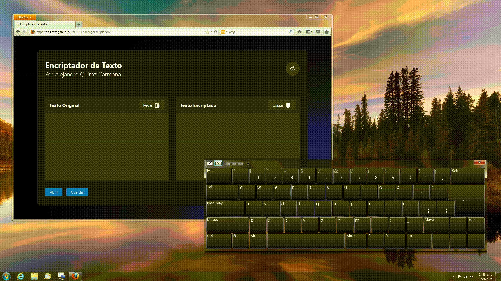

# Alura Challenge | Encriptador de Texto

Encriptador y desencriptador de texto recreativo para intercambiar mensajes.

## Código para encriptar/desencriptar

- La letra "e" es convertida para "enter"
- La letra "i" es convertida para "imes"
- La letra "a" es convertida para "ai"
- La letra "o" es convertida para "ober"
- La letra "u" es convertida para "ufat"

## Características 

- Interfaz elegante y responsiva
- Importar y exportar mensajes desde un archivo de texto
- Importar y exportar mensajes desde el portapapeles
- Conversión en tiempo real
- Conversión automática de mayusculas a minusculas
- Eliminación automática de acentos

## Restricciones

- Solo se admiten letras minusculas
- Se admiten las letras Ñ y Ç
- No se admiten números
- No se admiten letras con acentos
- No se admiten caracteres especíales 

## Demostración 
